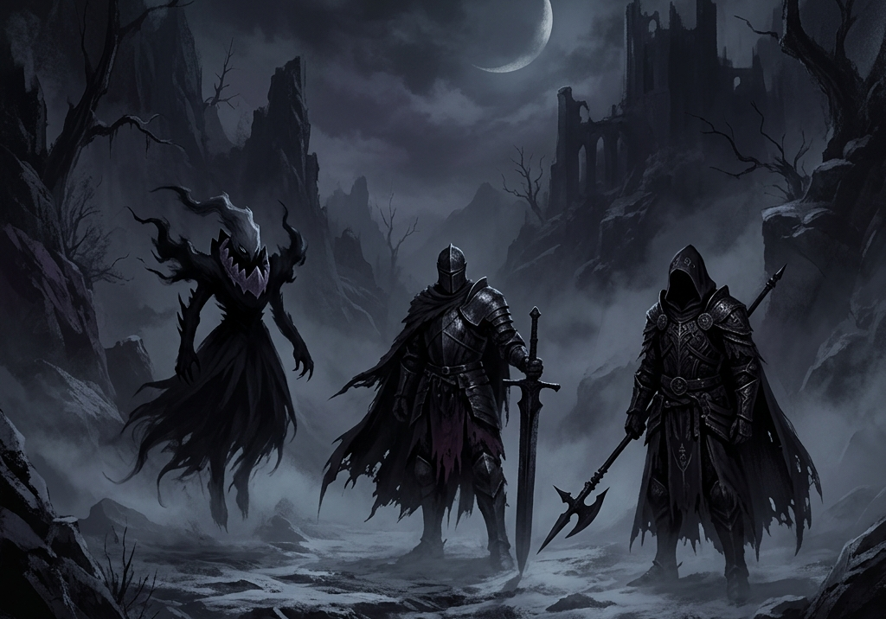

<table border="0" cellpadding="0" cellspacing="0">
  <tr>
    <td align="center" valign="top" width="340">
      <h3>darkbrood</h3>
      
    </td>
    <td align="center" valign="top" width="340">
      <h3>godot</h3>
      
    </td>
  </tr>
</table>

  

  
  
  
  
  
  
  
  

